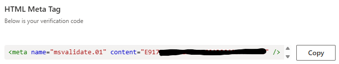

# Backlink Tutorial & Checklist

---

## 1. Login to WordPress Admin

- **URL:** [https://jetwin77pro.com/fryer37](https://jetwin77pro.com/fryer37)
- **Username:** `sharkhelp@outlook.com`
- **Password:** `CuteShark123$`

---

## 2. Edit the Home Page with Elementor

- Navigate to: **Pages > Home > Edit with Elementor**
- 
- *Open this in a new tab for convenience.*

---

## 3. Create the Home Page

You can design the home page as you wish, but make sure to include the following:

- **Only ONE H1 heading** that describes the website (important for search engine crawlers)
- **At least 300 words** in total
  - Must have **primary keyphrase** at least once
- **Images:**
  - Must have **alt text**
  - Must have a **caption** containing one of the keyphrases from Yoast SEO (see below)
  - > Google's AI **Gemini** is good for generating images quickly.
- **Only ONE BUTTON**:
  - Button text must be one of the keyphrases
  - Button must link to [wehatefeds.com](https://wehatefeds.com)

---

## 4. Complete the Yoast SEO Fields for the Home Page

- Navigate to: **Pages > Home > Edit**
- **Keyphrases:**
    - buy crypto
    - buy crypto no id
    - buy crypto with credit card
    - buy bitcoin anonymously
    - buy crypto with card
    - > ***choose any keyphrase to be the key phrase***
- **SEO Title and Meta Description**
    - write an SEO title and meta description specific to the website
    - feel free to use AI to help write them
    - example:
    
> Fix any **red** SEO issues Yoast mentions about the page. If you can, yellow issues as well.

---

## 5. Design 2 More Additional Pages

Once again, you can design this pages however you like but the requirements remain the same:

- **Only ONE H1 heading** that describes the website (important for search engine crawlers)
- **At least 300 words** in total
  - Must have **primary keyphrase** at least once
- **Images:**
  - Must have **alt text**
  - Must have a **caption** containing one of the keyphrases from Yoast SEO (see below)
  - > Google's AI **Gemini** is good for generating images quickly.
- **Only ONE BUTTON**:
  - Button text must be one of the keyphrases
  - > Each page should have a different keyphrase for the button.
  - Button must link to [wehatefeds.com](https://wehatefeds.com)

  ---

## 6. Complete Yoast SEO for Additional Pages

Similar to Home Page SEO with less steps:
- Add only **primary keyphrase** (same as home page primary keyphrase)
- **Write meta description** that has **primary keyphrase** in it
  - Leave SEO title as default
- example:


---

## 7. Review Website

- Navigate to: **Settings > General**
- Change **Tagline** to Home page SEO title
- Save changes at bottom
- Navigate to: **Settings > Reading**
- For "Your homepage displays":
  - Set to ***A static page*** and Homepage to **Home**
- Save changes at bottom

---

## 8. Submit to Bing Webmaster Tools for Indexing

- **Login/Create Account at:** [https://www.bing.com/webmasters/about](https://www.bing.com/webmasters/about)
- **Add New Website** and copy **Meta Tag**
  - example:
  
- Go **Back to Backlink Website** and Navigate to: **Appearance > Theme File Editor >> Theme Header (header.php)**
  - Paste **meta tag** as first line in ***&lt;head&gt;***:
  > 
    ```html
    <head>
      <meta name="msvalidate.01" content="E91777E86021DC9060A38C603FFF657D" />
      
      <?php do_action('blocksy:head:start') ?>

      <meta charset="<?php bloginfo( 'charset' ); ?>">
      <meta name="viewport" content="width=device-width, initial-scale=1, maximum-scale=5, viewport-fit=cover">
      <link rel="profile" href="https://gmpg.org/xfn/11">

      <?php wp_head(); ?>
      <?php do_action('blocksy:head:end') ?>
    </head>
    ```
  - Click **Update File** at bottom
- Return to **Bing Webmasters Tools** and **Verify** Backlink
- Navigate to: **URL Inspection** and submit each webpage for inspection
  - E.g. /home, /about-us, /guides
  - Click **Live URL** to check for any SEO errors
  - If all is good, click **Request Indexing** and go to next webpage

---

## 9. Submit Sitemap and Start Site Scan

- Navigate to: **Sitemaps** and click **Submit Sitemap**
  - Yoast SEO sitemaps always follow the same format:
  > ```
      https://backlink.com/sitemap_index.xml
  
      example: https://comorezarrosario.com/sitemap_index.xml
    ```
- Navigate to: **Site Scan** and click **Start new scan**
  - Name it whatever, leave **Scope** as **Website**, Mark **Crawl all subdomains** and Limit Scan to **10 Pages**
  - Click **Start Scan**

---

### Done!